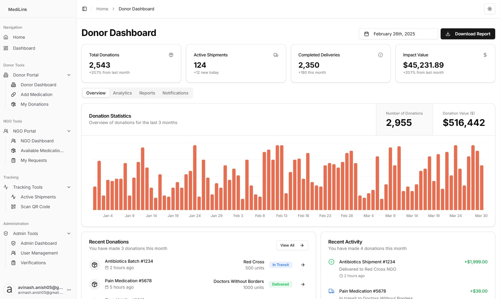

# MediLink 

MediLink is a platform connecting pharmaceutical companies and hospitals with NGOs to facilitate medical donations and improve healthcare accessibility.


## Key Features

### For Donors (Pharmaceutical Companies & Hospitals)
- Donation management dashboard with real-time statistics
- Activity tracking and donation monitoring

### For NGOs
- Real-time medication availability tracking
- Request management system

### Platform Features
- Real-time medication tracking 
- Role-based access control
- Admin dashboard for platform management
- Organization verification system
- Interactive medication marketplace

## Technical Setup

This is a [Next.js](https://nextjs.org) project bootstrapped with [`create-next-app`](https://nextjs.org/docs/app/api-reference/cli/create-next-app).

### Getting Started

1. Clone the repository and install dependencies:
```bash
git clone https://github.com/CubeStar1/medilink.git
cd medilink
npm install
```

2. Set up environment variables:
Create a `.env` file in the root directory with the following variables:
```bash
# Supabase Configuration
NEXT_PUBLIC_SUPABASE_URL=your_supabase_url
NEXT_PUBLIC_SUPABASE_ANON_KEY=your_supabase_anon_key
SUPABASE_ADMIN=your_supabase_service_role_key

# Email Service Configuration
RESEND_API_KEY=your_resend_api_key
RESEND_DOMAIN=your_domain
```

3. Run the development server:
```bash
npm run dev

```

4. Open [http://localhost:3000](http://localhost:3000).

